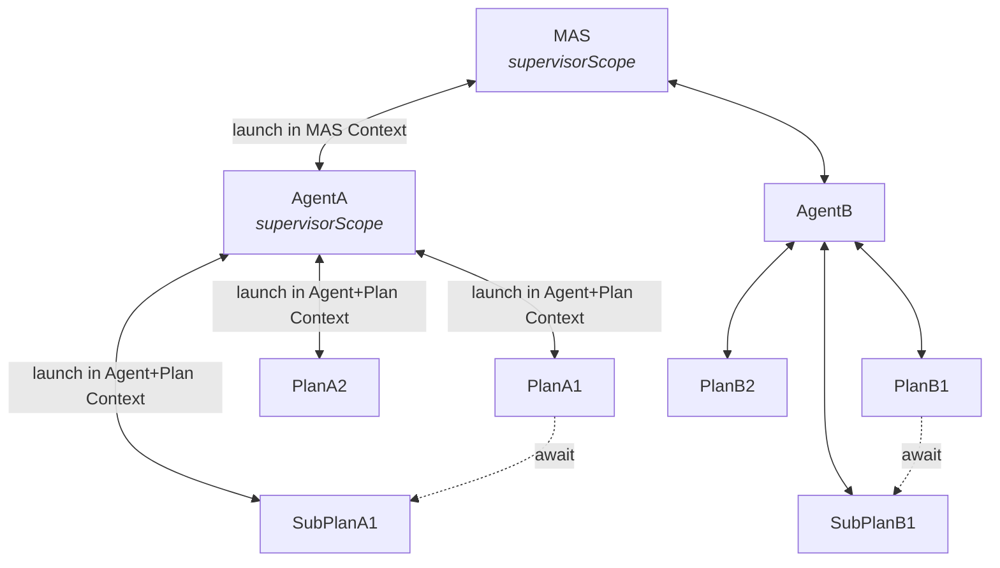

# kotlin-coroutines-scheduling

Coroutine Relationships

```mermaid
flowchart TD
MAS["`MAS
    *supervisorScope*`"]

AgentA["`AgentA
    *supervisorScope*`"]


    MAS <-->|launch in MAS Context| AgentA
    MAS <--> AgentB
    AgentA <-->|launch in Agent+Plan Context| PlanA1
    AgentA <-->|launch in Agent+Plan Context| PlanA2
    AgentA <-->|launch in Agent+Plan Context| SubPlanA1
    PlanA1-.->|await| SubPlanA1

    AgentB <--> PlanB1
    AgentB <--> PlanB2
    AgentB <--> SubPlanB1
    PlanB1-.->|await| SubPlanB1
```