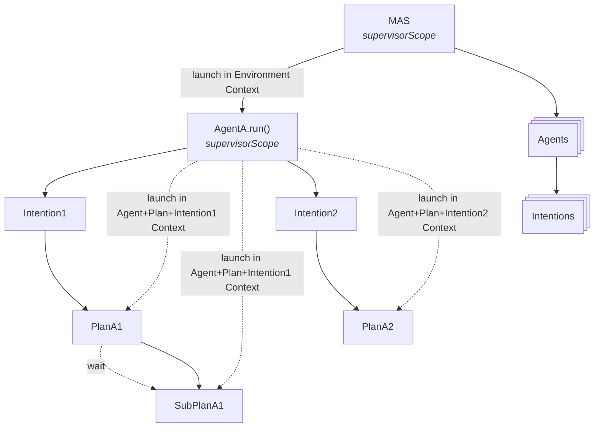

# kotlin-coroutines-scheduling

Coroutine Relationships

Arrows represent parent-child relationships

Dotted arrows represent operations across coroutines that are not linear

```mermaid
flowchart TD
MAS["`MAS
    *supervisorScope*`"]

AgentA["`AgentA.run()
    *supervisorScope*`"]

    MAS -->|launch in Environment Context| AgentA

    AgentA --> Intention1
    Intention1 --> PlanA1
    AgentA -.->|launch in Agent+Plan+Intention1 Context| PlanA1
    AgentA -.->|launch in Agent+Plan+Intention1 Context| SubPlanA1
    PlanA1-.->|wait| SubPlanA1
    PlanA1 --> SubPlanA1

    AgentA --> Intention2
    AgentA -.->|launch in Agent+Plan+Intention2 Context| PlanA2
    Intention2 --> PlanA2
   
    
    MAS --> AB@{ shape: procs, label: "Agents"}
    AB -->  D@{ shape: procs, label: "Intentions"}
    
```